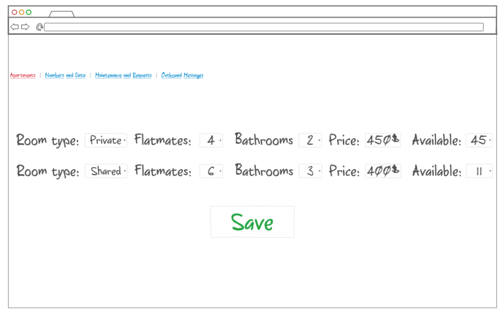
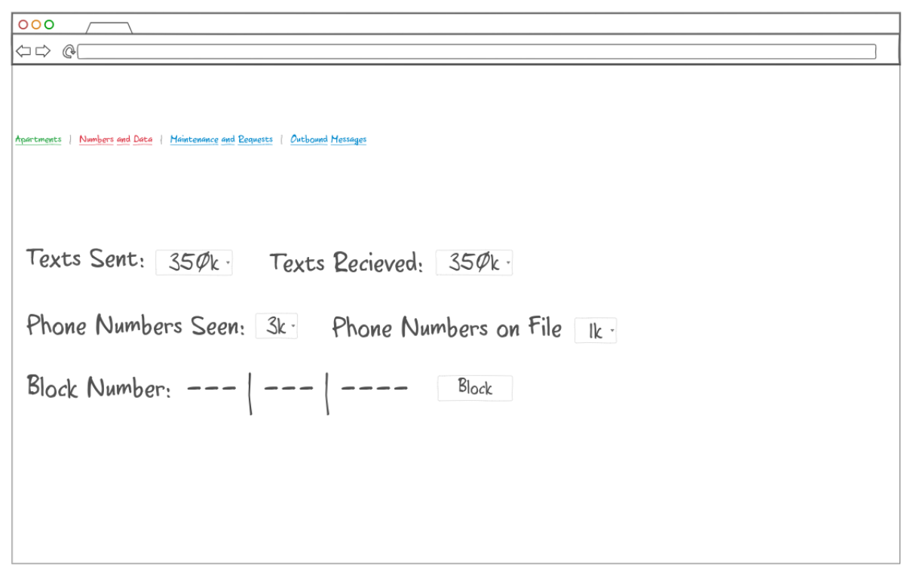
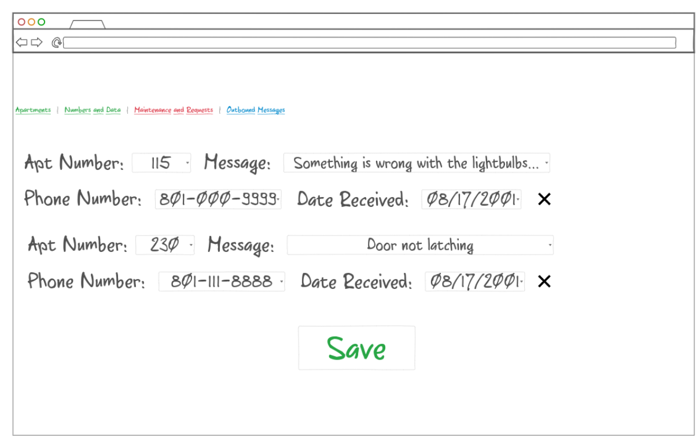
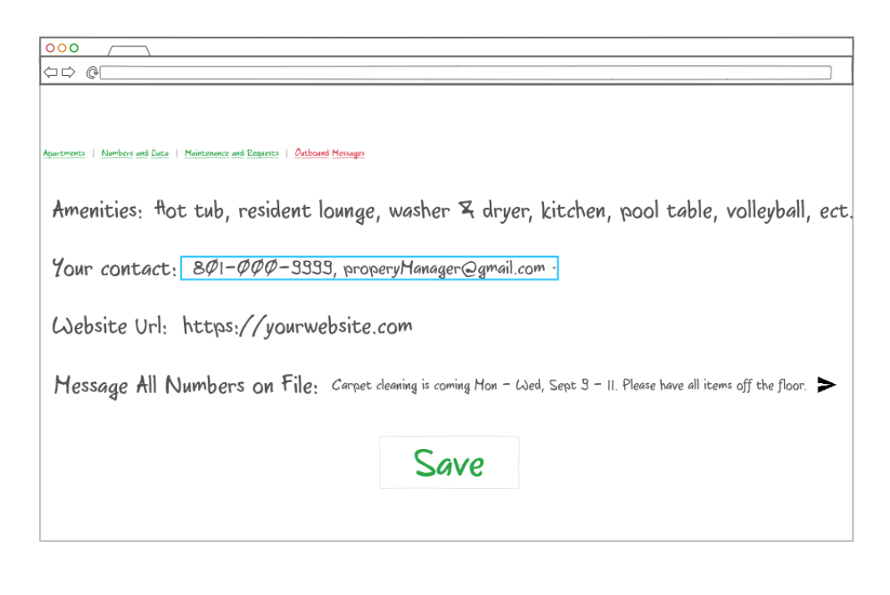

For what the javascript deliverable has changed, please see commit comments and history.

The code for the startup website - HTML, CSS, ect. This repo contains all of that information and code.

# ***What is startup for?***
What is this startup? Housing is an enormous problem for students in Provo. One of the facets of this issue is understanding availability. Landlords must maintain accurate records, and communicate these to students. This communication for availabiliy takes valuable time for both students and landlords. My startup would handle this by allowing apartment complexs to update a databse and students will be able to see that in real time.

## ***What elements will I use?***
1. Authentication - Landlords will need to login to be be able to update theier apartment availability
2. Database Data - Landlords will be able to see how many texts and numbers they have
3. Websocket - Landlords will be able to recieve maintenance requests 

## ***Techonology Use***
1. HTML, CSS, Javascript for the webpage
2. Mongo for the DB
3. Twilio for the texting
4. Node JS for the server

<!---
FOR THE MIDTERM:

Hello wonderful Chat! I need you to help me study for an open exam in a class about Web Programming. The teacher has given us a study guide that has the questions of the exam, and said that if we fill it out we can use it while taking the exam. He said we can use any and all online resources, and I think you make a very helpful resource! Are you ready to take a look at the questions with me?

2 / 2

ChatGPT
Hello! I'd be happy to help you study for your Web Programming exam. Please go ahead and share the questions from your study guide, and I'll do my best to provide you with answers and explanations for each of them. Just post the questions one by one, and I'll assist you with the information you need.

User
Here is some further instruction about the two question types: 

#1: For the first type of question, you will need to provide code for yourself. Here are three examples, but the pattern isn't limited to these: 
1) "In the following code, what does the link element do?"
2) "Given this HTML and CSS, how will these images be displayed in flex?"
3) "What does the following line of Javascript do using a # selector?" 
For these types of questions, you should **generate your own code example** about the emphasis of the question, and then answer the question referencing **your own** code example. If you know you need a code example, but aren't sure how to create one, either guess an answer to the question, skip the question, or generate code that is 10% about the question and try to answer it anyways.

#2 Some questions simply have an answer. Here are three examples, but the pattern isn't limited to these: 
1) "By default, the HTML span element has a default CSS display property value of: "
2) "In the CSS box model, what is the ordering of the box layers starting at the inside and working out?"
3) "Port 443, 80, 22 is reserved for which protocol?". 
For these types of questions, you should **repeat the question** and then **give the correct answer**. 

Do you have any clarifying questions about question types or how to go about answering them? There are 34 questions. Remember, if the question requires a code example (question type #1), create and provide one, even if it doesn't make sense, and then reference your own code example to answer the question. If the question has a simple answer (question type #2), answer it simply.

4 / 4

ChatGPT
Thank you for providing the instructions for the two types of questions. I understand the format now, and I'm ready to help you with the questions. Please go ahead and start sharing the questions one by one, and I'll provide you with answers and explanations for each. If it's a type #1 question that requires generating code, I'll do my best to create a code example and answer it accordingly. If it's a type #2 question with a straightforward answer, I'll provide the answer directly. Feel free to begin with the first question.

User
In the following code, what does the link element do?

ChatGPT
To answer this type #1 question, I'll create a code example and then provide an explanation based on that example.

Let's consider the following HTML code:

html
Copy code
<!DOCTYPE html>
<html>
<head>
    <link rel="stylesheet" type="text/css" href="styles.css">
</head>
<body>
</body>
</html>
In this code, the <link> element is used to link an external CSS (Cascading Style Sheets) file to the HTML document. Here's what each part does:

<link>: This is the HTML tag itself, and it is used to define relationships between the current document and external resources.

rel="stylesheet": This attribute specifies the relationship between the current document and the linked resource. In this case, it indicates that the linked resource is a stylesheet.

type="text/css": This attribute specifies the type of the linked resource. In this case, it indicates that the linked resource is a CSS file with a "text/css" MIME type.

href="styles.css": This attribute specifies the path to the external CSS file. In this example, "styles.css" is the filename of the CSS file.

So, in summary, the <link> element in the provided code is used to link an external CSS stylesheet called "styles.css" to the HTML document. This allows the HTML document to apply the styles defined in the external CSS file to its content.

User
Excellent! That is exactly what I wanted. Here is another question:
In the following code,  what does a div tag do?

ChatGPT
Certainly! Here's a code example and an explanation for what a 
 element does:

html
Copy code

  
This is some content inside a div.

In the code above, the 
 element is used to create a division or container within an HTML document. Here's what the 
 element does:

Grouping Content: The primary purpose of the 
 element is to group and structure content together. It acts as a container or a block-level element that can hold other HTML elements, such as text, images, other elements, or even more 
 elements. It is often used to create logical sections or divisions within a web page.

Styling and Layout: 
 elements are commonly used as building blocks for defining the layout and structure of a web page. Web developers can apply CSS styles and properties to 
 elements to control their appearance and positioning on the page.

JavaScript Interaction: 
 elements are often used as containers for adding interactivity through JavaScript. For example, you can attach event handlers to a 
 to respond to user interactions.

Semantic Meaning: The 
 element itself doesn't carry any specific semantic meaning. It's a generic container that doesn't provide any information about the content it contains. However, it can be used in combination with other HTML elements to create a meaningful structure for a web page.

In summary, the 
 element in the provided code is used to create a container that can group and structure content, define layout, and provide a target for styling and scripting. Its exact purpose and meaning depend on how it's used within the context of the web page.

User
Well done. In the following code, what is the difference between the #title and .grid selector?

ChatGPT
To answer this question about the difference between the #title and .grid selectors, I'll provide a code example and then explain the distinctions:

html
Copy code
<!DOCTYPE html>
<html>
<head>
    
</head>
<body>
    <h1 id="title">This is a Heading</h1>
    
This is a grid container.

</body>
</html>
In this code, we have two CSS selectors:

#title: This is an ID selector. It is used to target the HTML element with the id attribute of "title." In this case, it's applied to the <h1> element.

.grid: This is a class selector. It is used to target HTML elements with the class attribute of "grid." In this case, it's applied to the 
 element.

Now, let's discuss the differences:

#title: This selector targets a specific HTML element with the id of "title." It's used to style that specific element. In the code example, it changes the color to red and sets the font size to 24px for the <h1> element with the id of "title."

.grid: This selector targets all HTML elements with the class "grid." It can be used to style multiple elements with this class. In the code example, it adds a black border and sets a light gray background color for the 
 element with the class "grid."

In summary, the difference between the #title and .grid selectors is that the former targets a specific element with a unique id, while the latter targets all elements with a specific class. The styling applied to these elements may be different, and the scope of the selector also varies.

User
That's great!
In the following code, what is the difference between padding and margin?

ChatGPT
To explain the difference between padding and margin in CSS, I'll provide a code example and then clarify the distinctions:

html
Copy code
<!DOCTYPE html>
<html>
<head>
    
</head>
<body>
    
This is a box

</body>
</html>
In this code, we have a 
 element with the class "box," and we've applied both padding and margin to it.

Now, let's discuss the differences between padding and margin:

Padding:

Padding is the space inside an element between its content and its border.
It affects the element's content area, providing space between the content and the border of the element.
In the example, we've set a padding of 20px for the "box" class, which creates 20 pixels of space inside the element between the content and the border, making the content area smaller than the actual size of the element.
Margin:

Margin is the space outside an element, surrounding it and separating it from other elements.
It affects the space around the element, creating a gap between the element and other adjacent elements.
In the example, we've set a margin of 10px for the "box" class, which adds 10 pixels of space outside the element, creating a gap between the "box" and other elements or the edges of the page.
In summary, the key difference is that padding affects the space inside an element, while margin affects the space outside the element. Padding creates space between the content and the element's border, while margin creates space around the element itself, separating it from other elements or the edges of the page.

User
Here is a challenge, I know you can do it!
Given this HTML and this CSS how will the images be displayed using flex?

ChatGPT
I'm glad to take on the challenge! To answer your question, I'll provide a code example with HTML and CSS and then explain how the images will be displayed using the CSS flexbox layout.

HTML:

html
Copy code
<!DOCTYPE html>
<html>
<head>
    <link rel="stylesheet" type="text/css" href="styles.css">
</head>
<body>
    

        

            
        

        

            
        

        

            
        

    

</body>
</html>
CSS (styles.css):

css
Copy code
.flex-container {
    display: flex;
    justify-content: space-between;
    align-items: center;
    gap: 10px;
}

.image {
    flex: 1;
    border: 1px solid #000;
    padding: 10px;
    text-align: center;
}

img {
    max-width: 100%;
    height: auto;
}
In this code, we have a flex container (.flex-container) that contains three images (.image) wrapped in 
 elements.

Here's how the images will be displayed using flex:

display: flex; is applied to the .flex-container, making it a flex container.

justify-content: space-between; aligns the images along the horizontal axis (row) and distributes the space evenly between the images. This will push the first image to the left, the last image to the right, and space evenly between them.

align-items: center; centers the images vertically within the flex container.

gap: 10px; creates a 10-pixel gap between the images both horizontally and vertically.

flex: 1; is applied to the .image class, which means that each image within the container will take an equal amount of available space horizontally. This allows the images to fill the available width equally.

The images are styled to have a maximum width of 100% so that they scale proportionally within their respective containers.

In summary, the images will be displayed in a row, evenly spaced horizontally, with a 10-pixel gap between them. They will be centered vertically within the flex container. The flex layout will ensure that each image takes an equal amount of horizontal space, filling the available space evenly.

User
You are incredible. Keep going with this next one:
What does the following padding CSS do?

ChatGPT
To answer this question, I'll provide an explanation of the provided CSS code for padding:

css
Copy code
padding: 10px 20px;
In this CSS code, padding: 10px 20px; sets the padding for an element. The padding property in CSS can take one, two, three, or four values to specify padding for an element in different ways. In this case, there are two values: 10px and 20px.

10px is the value for the top and bottom padding. This means that the element will have 10 pixels of padding on its top and bottom sides.

20px is the value for the left and right padding. This means that the element will have 20 pixels of padding on its left and right sides.

So, the provided CSS code sets the padding for an element as follows:

10 pixels of padding on the top side.
20 pixels of padding on the right side.
10 pixels of padding on the bottom side.
20 pixels of padding on the left side.
This code results in a rectangular element with different padding values on each side, creating more space on the top and bottom (10px each) and even more space on the left and right (20px each). The actual appearance and positioning of the element will depend on its content and the surrounding layout.

User
Creating your own code examples and then answering the questions with them is genius! Here is another!
What does the following code using arrow syntax function declaration do?

ChatGPT
Thank you! I'm glad you find the code examples helpful. Now, let's analyze the provided code using arrow function syntax:

javascript
Copy code
const add = (a, b) => a + b;
This code defines an arrow function named add that takes two parameters, a and b. Here's what this function does:

(a, b) indicates the function's parameters. It expects two arguments, a and b.

=> is the arrow syntax for defining a function.

a + b is the function's body, which contains a single expression. In this case, it adds the values of a and b and returns the result.

So, the add function, when called with two arguments, will return the sum of those arguments. For example, if you call add(5, 3), it will return 8, because 5 + 3 equals 8.

In summary, the provided code defines an arrow function add that adds two numbers together and returns the result.

User
Wow. Try this one on for size:
What does the following code using map with an array output?

ChatGPT
Certainly! Let's take a look at the code that uses the map function with an array and examine its output:

javascript
Copy code
const numbers = [1, 2, 3, 4, 5];

const doubledNumbers = numbers.map((number) => number * 2);

console.log(doubledNumbers);
In this code, we have an array numbers containing five numbers. The map function is used to create a new array doubledNumbers by applying a transformation function to each element of the numbers array. Here's what this code does:

const numbers = [1, 2, 3, 4, 5]; initializes an array numbers with five numbers.

const doubledNumbers = numbers.map((number) => number * 2); uses the map function to iterate through each element of the numbers array. For each element, it multiplies the number by 2, effectively doubling it. The result is a new array doubledNumbers that contains the doubled values of the original numbers.

console.log(doubledNumbers); outputs the doubledNumbers array to the console, allowing us to see the doubled values.

So, when you run this code, the doubledNumbers array will contain [2, 4, 6, 8, 10]. Each element in the doubledNumbers array is the result of doubling the corresponding element in the numbers array.

User
How did people code without you! Here is another!
What does the following code output using getElementByID and addEventListener?

ChatGPT
I'm glad you find the explanations helpful! Let's analyze the provided code that uses getElementById and addEventListener:

html
Copy code
<!DOCTYPE html>
<html>
<head>
    
</head>
<body>
    <button id="myButton">Click Me</button>

    
</body>
</html>
In this code, we have an HTML document with a button element, and we're using JavaScript to add an event listener to the button element. Here's what this code does:

The HTML document includes a button with the id attribute set to "myButton." This id is used to identify the button element.

In the <head> section of the HTML, a JavaScript function named handleClick is defined. This function displays an alert with the message "Button Clicked!" when called.

In the <body> section of the HTML, there's a 
    --->
<!---
</body>
</html>
In this example:

We have an HTML element with the id of "byu" within a 
 element.

In the <style> section, we initially set the text color to red using CSS.

In the 
    --->
<!---    
</head>
<body>
</body>
</html>
You can place the 
</head>
<body>
    
animal

    
fish

</body>
</html>
In this code:

We use window.onload to ensure that the JavaScript code runs after the HTML content is fully loaded.

We use document.getElementById("animal") to find the element with the id "animal."

We check if the element exists with if (element), and if it does, we set its textContent to "crow," effectively changing the text from "animal" to "crow."

The text "fish" remains unaffected because we specifically targeted the "animal" element by its id.

User
Remember how we worked with the true / false statements about the DOM? Do the same with this question! Which of the following correctly describes JSON?

ChatGPT
Certainly! Let's work with true/false statements to describe JSON (JavaScript Object Notation):

True: JSON is a lightweight data-interchange format. (True)

True: JSON is easy for humans to read and write. (True)

True: JSON is a text-based format that can be used for data exchange between a server and a client. (True)

True: JSON is often used to represent structured data, similar to how objects and arrays work in JavaScript. (True)

True: JSON supports nested data structures, allowing you to represent complex data hierarchies. (True)

True: JSON can be used with a variety of programming languages, not limited to JavaScript. (True)

False: JSON is a programming language. (False)

False: JSON is a binary data format. (False)

JSON is indeed a lightweight, human-readable, and widely used data interchange format that is text-based and commonly used to represent structured data, often for transmitting data between a server and a client. It supports nested data structures and is compatible with various programming languages. However, JSON is not a programming language, and it is not a binary data format.

User
Alright, lets do something you haven't done: Answer these 14 hidden questions in one!
What does the console command chmod, pwd, cd, ls, vim, nano, mkdir, mv, rm, man, ssh, ps, wget, sudo  do?

ChatGPT
Certainly, let's answer these 14 questions in one:

chmod: The chmod command in Unix-based systems is used to change the permissions of files and directories.

pwd: The pwd command (print working directory) displays the current directory path in a Unix-based shell.

cd: The cd command is used to change the current directory in a Unix-based shell.

ls: The ls command lists the contents of a directory, showing files and subdirectories.

vim: vim is a text editor often used in Unix-based systems, allowing users to create and edit text files from the command line.

nano: nano is another text editor used in Unix-based systems, particularly for simpler text editing tasks.

mkdir: The mkdir command is used to create a new directory (folder).

mv: The mv command is used to move or rename files and directories.

rm: The rm command is used to remove (delete) files and directories.

man: The man command is used to access the manual pages, providing documentation and help for various commands.

ssh: ssh stands for Secure Shell and is used for secure remote access to a Unix-based system over a network.

ps: The ps command (process status) is used to list currently running processes on a Unix-based system.

wget: wget is a command-line utility used to download files from the web.

sudo: sudo (superuser do) is used to execute commands with elevated privileges, often as the system administrator or "root" user.

These commands are commonly used in Unix-based operating systems (e.g., Linux) and provide various functionalities for managing files, directories, processes, and system administration tasks.

User
You are incredible at this! Ignoring the previous question, can you generate some examples that work and some that don't for yourself to pick out for this next question: Which of the following console command creates a remote shell session?

2 / 2

ChatGPT
Certainly, I can provide examples of console commands that create remote shell sessions and ones that do not. Afterward, I'll indicate which one creates a remote shell session.

Commands that create a remote shell session:

ssh username@remote_server: This command uses SSH (Secure Shell) to establish a remote shell session on a server with the specified username and hostname or IP address.

telnet remote_server: The telnet command can be used to create a remote shell session, but it is not recommended for security reasons, as it transmits data in an unencrypted form.

Commands that do not create a remote shell session:

ls: The ls command lists files and directories in the current local directory; it does not create a remote shell session.

cat file.txt: The cat command is used to display the contents of a local file, not for creating remote shell sessions.

ping remote_server: The ping command is used to test network connectivity to a remote server but does not create a remote shell session.

The command that creates a remote shell session is:

ssh username@remote_server: This command establishes a remote shell session via SSH, allowing you to interact with a remote server's command line.
Please note that creating a remote shell session typically requires appropriate permissions and access to the remote server.

User
Give me some generalized answers (but mostly possibilities! And an example!) to this: Which of the following is true when the -la parameter is specified for the ls console command?

2 / 2

ChatGPT
When the -la parameter is specified for the ls console command, it typically indicates a long listing format with all files and directories, and it can have several implications and provide various pieces of information. Here are some generalized possibilities and an example:

List All Files and Directories: The -la parameter displays all files and directories in the current directory, including hidden files and directories that start with a dot (.).

Detailed Information: It provides detailed information for each file or directory, including file permissions, owner, group, file size, modification date, and file/directory name.

Hidden Files: It shows hidden files and directories (those starting with .) in addition to regular files and directories.

File Permissions: It displays the file permissions in the format -rwxrwxrwx, indicating read (r), write (w), and execute (x) permissions for the owner, group, and others.

Example:

bash
Copy code
$ ls -la
total 16
drwxr-xr-x  3 user user 4096 Oct 30 10:00 .
drwxr-xr-x 18 user user 4096 Oct 30 09:55 ..
-rw-r--r--  1 user user    0 Oct 30 09:55 file1.txt
-rwxr-xr-x  1 user user    0 Oct 30 09:55 script.sh
-rw-r--r--  1 user user    0 Oct 30 09:55 .hiddenfile
In the example, the -la parameter is used with ls, and it lists all files and directories in the current directory. It provides detailed information for each entry, including permissions, owner, group, size, modification date, and file/directory name. Hidden files (e.g., .hiddenfile) are also displayed.

User
Wow! Lets see you do something similar with this one! Which of the following is true for the domain name banana.fruit.bozo.click, which is the top level domain, which is a subdomain, which is a root domain?

ChatGPT
When analyzing the domain name "banana.fruit.bozo.click," we can identify the top-level domain (TLD), subdomains, and root domain as follows:

Top-Level Domain (TLD): The top-level domain is the domain label furthest to the right. In this case, "click" is the TLD. Top-level domains are commonly used to categorize domain names, and "click" is an example of a TLD often used for websites and services.

Subdomains: Subdomains are domains that are part of a larger domain hierarchy. They are located to the left of the TLD. In this domain name:

"banana" is a subdomain of "fruit."
"fruit" is a subdomain of "bozo."
Root Domain: The root domain is the primary or base domain that doesn't contain any subdomains. In this case, "bozo.click" is the root domain. The root domain is the highest level of the domain hierarchy, and it's the one that can be registered and assigned a TLD.

So, in the domain name "banana.fruit.bozo.click":

"click" is the top-level domain (TLD).
"banana" and "fruit" are subdomains.
"bozo.click" is the root domain.

User
Hmm, well thought out! Here is a piece of cake: Is a web certificate is necessary to use HTTPS.

ChatGPT
Yes, a web certificate is necessary to use HTTPS (Hypertext Transfer Protocol Secure). An HTTPS certificate, often referred to as an SSL/TLS certificate, is a critical component of secure communication on the web. Here's why it's necessary:

Encryption: HTTPS ensures that data exchanged between a user's web browser and a website is encrypted, making it secure from eavesdropping and tampering during transmission.

Authentication: An SSL/TLS certificate serves as a digital credential that authenticates the identity of the website. It confirms that the website is legitimate and not an imposter.

Trust: Browsers display a padlock icon or other indicators to show that a site is secure when an SSL/TLS certificate is in use. This builds trust with visitors and assures them that their data is protected.

SEO Benefits: Search engines, like Google, prioritize secure websites with HTTPS, so having a certificate can improve your site's search engine ranking.

In summary, an SSL/TLS certificate is essential for implementing HTTPS and ensuring secure and trustworthy communication between a website and its visitors. It's a fundamental element for data security and user trust on the web.

User
Well done! You are so smart! Can a DNS A record can point to an IP address or another A record.

ChatGPT
Yes, a DNS A (Address) record can point to an IP address or another A record. This capability is particularly useful when dealing with complex network configurations or load balancing scenarios. Here's an explanation of both cases:

Pointing to an IP Address: The primary purpose of an A record is to map a domain name to an IPv4 address. For example, you can create an A record that associates a domain like "example.com" with an IP address like "203.0.113.1." This is the most common use of A records.

Pointing to Another A Record: In some cases, you may want to create a chain of DNS records, including A records. For example, you might have a subdomain like "sub.example.com" pointing to one IP address ("203.0.113.1") using an A record, and then have another A record pointing to "sub.example.com" from a different subdomain like "other.example.com." This effectively creates a chain where "other.example.com" indirectly points to the IP address of "203.0.113.1" through "sub.example.com."

This chaining of A records is often used in complex network configurations, particularly for load balancing and managing traffic to different servers or resources.

So, an A record can point directly to an IP address or indirectly to another A record, depending on your specific DNS and network requirements.

User
I've never thought about it like that. Here is another: Port 443, 80, 22 is reserved for which protocol?

ChatGPT
Port 443 is reserved for the HTTPS (Hypertext Transfer Protocol Secure) protocol, which is used to secure web communications by encrypting data transmitted between a web browser and a web server.

Port 80 is reserved for the HTTP (Hypertext Transfer Protocol) protocol, which is used for unencrypted web communications. Port 80 is the default port for unsecured web traffic.

Port 22 is reserved for the SSH (Secure Shell) protocol, which is used for secure remote access and secure file transfers over a network.

So, in summary:

Port 443: HTTPS
Port 80: HTTP
Port 22: SSH

User
Last question! It is a tough type #2 question, here you go! What will the following code using Promises output when executed?

ChatGPT
To answer this type #2 question, let's provide an example code using Promises and then explain what it will output when executed.

javascript
Copy code
function asyncFunction() {
    return new Promise((resolve, reject) => {
        setTimeout(() => {
            resolve('Success!');
        }, 1000);
    });
}

asyncFunction()
    .then((result) => {
        console.log(result);
        return 'Next Promise';
    })
    .then((result) => {
        console.log(result);
    });
In this code:

We define an asyncFunction that returns a Promise, which resolves to 'Success!' after a 1-second delay.

We call asyncFunction, and then we chain two .then handlers.

When this code is executed, it will output the following:

mathematica
Copy code
Success!
Next Promise
Here's what happens step by step:

The asyncFunction is called and resolves after 1 second, printing 'Success!' to the console.

The first .then handler receives 'Success!' as its argument and logs it to the console.

The first .then handler returns 'Next Promise', which is passed to the second .then handler.

The second .then handler receives 'Next Promise' and logs it to the console.

So, the code outputs 'Success!' and 'Next Promise' to the console in that order.

User
Wow Chat! I am going to ace my midterm because of you! Thank you!

ChatGPT
You're very welcome! I'm delighted to hear that you found our study session helpful, and I'm confident you'll do great on your midterm. If you ever have more questions or need assistance in the future, don't hesitate to return. Best of luck with your exam!
--->
