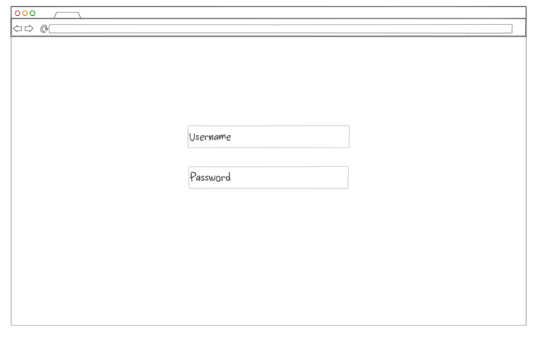
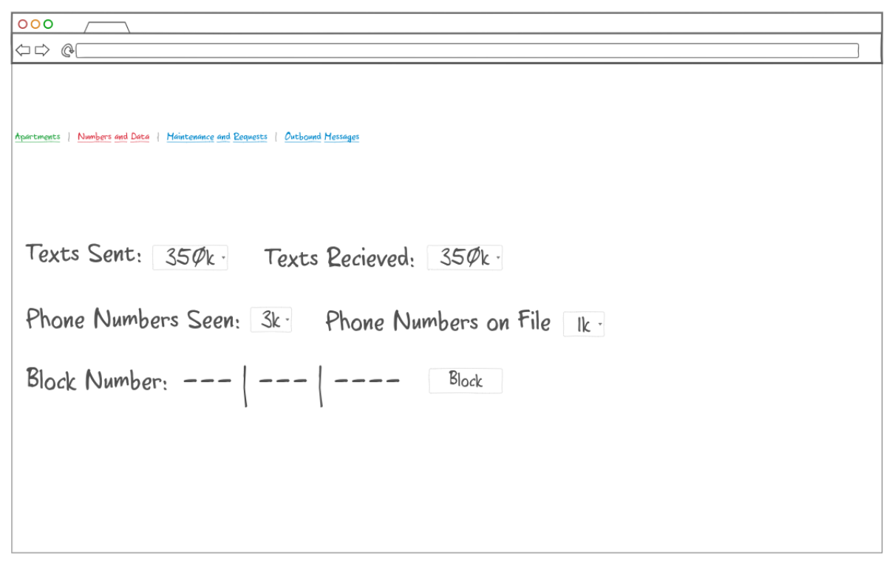
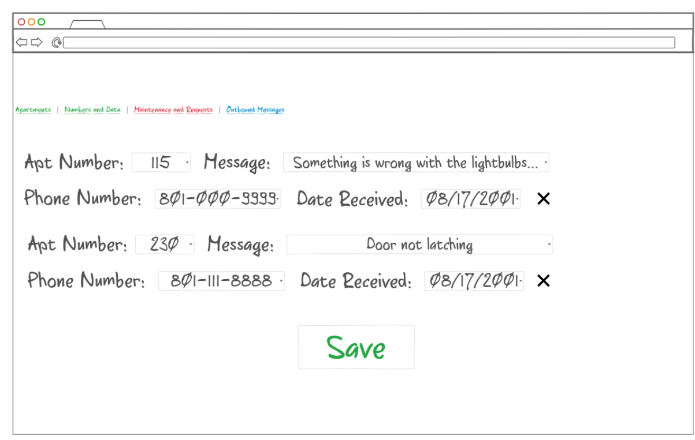
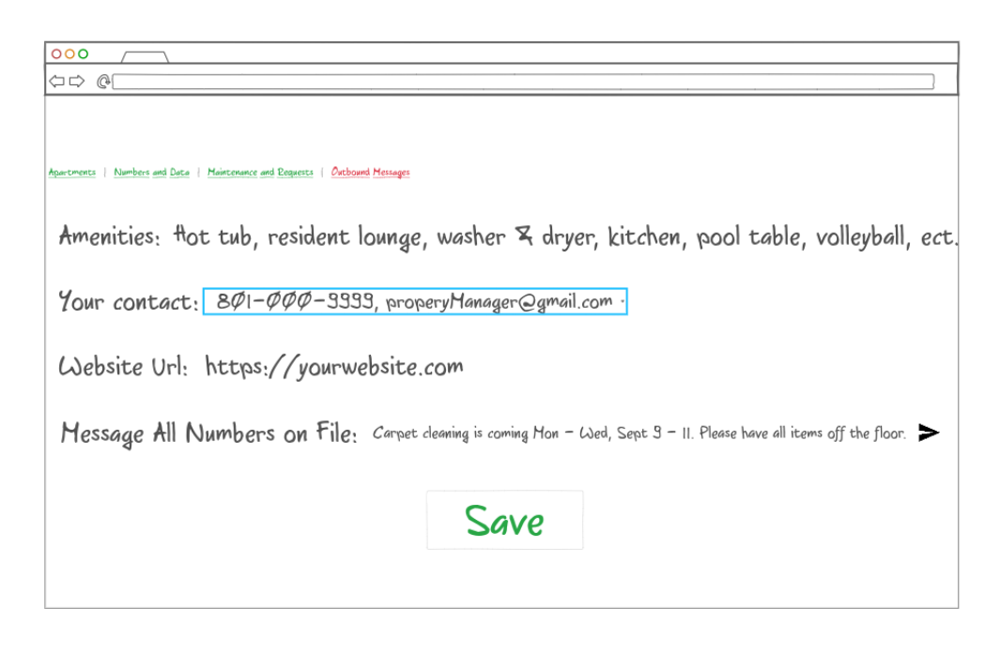

The code for the startup website - HTML, CSS, ect. This repo contains all of that information and code.

# ***What is startup for?***
What is this startup? Housing is an enormous problem for students in Provo. One of the facets of this issue is understanding availability. Landlords must maintain accurate records, and communicate these to students. This communication for availabiliy takes valuable time for both students and landlords. My startup would handle this by allowing apartment complexs to update a databse and students will be able to see that in real time.

## ***What elements will I use?***
1. Authentication - Landlords will need to login to be be able to update theier apartment availability
2. Database Data - Landlords will be able to see how many texts and numbers they have
3. Websocket - Landlords will be able to recieve maintenance requests 

## ***Techonology Use***
1. HTML, CSS, Javascript for the webpage
2. Mongo for the DB
3. Twilio for the texting
4. Node JS for the server

